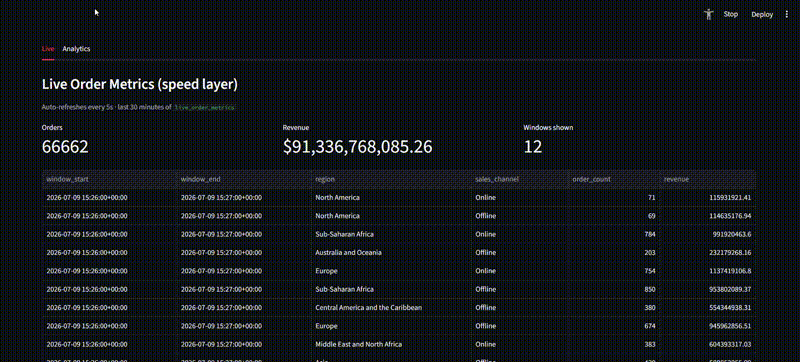
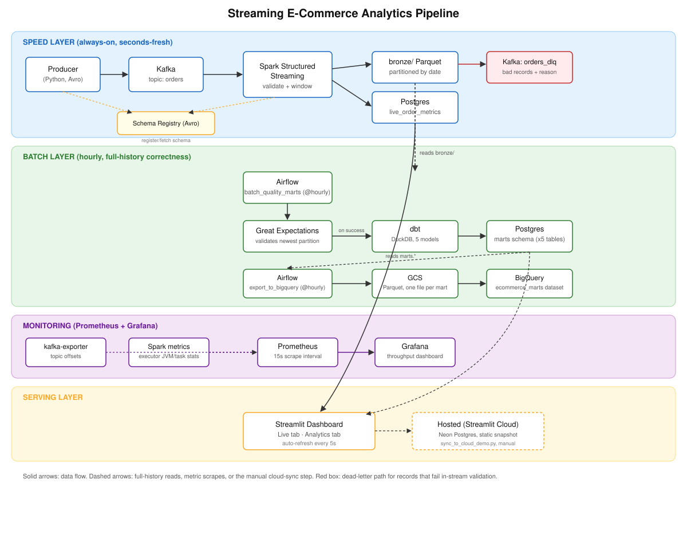

# Streaming E-Commerce Analytics Pipeline

[](https://github.com/MYASHWANTHREDDY/ecommerce-streaming-analytics/actions/workflows/ci.yml)

A real-time event pipeline for e-commerce order analytics — Kafka + Avro/Schema Registry, Spark Structured Streaming, Airflow, dbt, Great Expectations, Prometheus/Grafana, a BigQuery export, and a Streamlit dashboard, all wired together with Docker Compose.

**Hosted demo:** https://ecommerce-streaming-analytics.streamlit.app/ (static snapshot, synced periodically from the real pipeline — see [Hosted dashboard](#hosted-dashboard) below)

## Quick Start

```bash
# Terminal 1: start everything
make up

# Terminal 2: stream order events
make produce

# Terminal 3: dashboard
make demo
```

Visit `http://localhost:8501` to watch order metrics update in real time.



*(GIF not recorded yet — see [docs/dashboard-demo-instructions.md](docs/dashboard-demo-instructions.md).)*

## Architecture



<details>
<summary>Text version</summary>

```
[Producer] --schema--> [Schema Registry]
    |             \
    v              \--(delayed order_shipped, separate topic)
[Kafka: orders (Avro), 3 brokers] --> [Spark Structured Streaming] --> [Bronze Parquet] + [Postgres: live_order_metrics]
                                      |         \
                                      v          \--(stream-stream join)--> [Bronze Fulfillment Parquet]
                          [Kafka: orders_dlq] (bad records + reason)

[Airflow: batch_quality_marts (@hourly)] -> [Great Expectations] -> [dbt/DuckDB] -> [Postgres: marts.*]
[Airflow: export_to_bigquery (@hourly)]  -> reads marts.* -> [GCS Parquet] -> [BigQuery]

[kafka-exporter + Spark metrics + lag-reporter] -> [Prometheus] -> [Grafana]

[Postgres] -> [Streamlit: local dashboard]
[Postgres] --sync_to_cloud_demo.py (manual)--> [Neon Postgres] -> [Streamlit Community Cloud, hosted]
```

</details>

**Speed layer:** Spark reads Avro-encoded events from Kafka continuously, computes 1-minute windowed metrics (order count, revenue by region/channel), and writes them into `live_order_metrics` in Postgres. A second, genuinely separate `order_shipped` stream arrives some real seconds after each order, and Spark joins the two on the placed event's own `event_id` to compute real fulfillment time from actual message timestamps.

**Batch layer:** An hourly Airflow DAG validates the newest bronze partition with Great Expectations, then rebuilds the gold marts with dbt (5 models running on DuckDB against the full bronze history). A second hourly DAG exports those same marts to GCS and loads them into BigQuery.

**Monitoring:** Prometheus scrapes Kafka topic/offset metrics (via `kafka-exporter`), a real consumer-group lag signal (via `lag-reporter`), and Spark's per-executor JVM/task stats, visualized in a Grafana dashboard.

**Serving layer:** A Streamlit dashboard — a Live tab reading the speed layer, an Analytics tab reading the batch layer — running locally against the real pipeline, or hosted on Streamlit Community Cloud against a periodically-synced snapshot.

## Why these tools

- **Kafka, 3 brokers in KRaft mode** as the ingestion buffer — decouples the producer's pace from whatever's consuming it, gives durable replay, and makes a dead-letter pattern natural (bad records get their own topic instead of being dropped). Replication factor 3 / min ISR 2 means the cluster tolerates a broker dying without losing data or blocking writes — checked by actually killing a broker mid-stream, not just setting the config and assuming it works.
- **Avro + Schema Registry, not raw JSON** — the primary `orders` topic carries a registered schema, so a producer sending a malformed record (missing a required field, wrong type) gets rejected client-side before it ever reaches Kafka, instead of quietly polluting the topic. That does mean a schema can't catch everything — negative prices, absurd values, or a ship date before the order date are all schema-valid but still wrong, so Spark still runs its own semantic checks on top.
- **Spark Structured Streaming** for the speed layer — native Kafka source/sink, and checkpoint-based recovery means killing the Spark container and bringing it back resumes from the last committed offset instead of reprocessing or losing data.
- **Airflow 2.x with `LocalExecutor`, not Airflow 3** — Airflow 3's `LocalExecutor` needs an api-server, scheduler, dag-processor, and triggerer all running at once, which felt like a lot of extra containers for what's really just two hourly DAGs.
- **dbt on DuckDB for the gold marts**, not raw DuckDB scripts — the batch layer just needs SQL over a Parquet lake, and dbt gives that SQL actual schema tests (`not_null`, `unique`) instead of trusting it silently. DuckDB reads the bronze files directly and writes into Postgres through its own `postgres` extension, no second JVM job required.
- **Two-tier data quality** — Spark's in-stream checks (schema, ranges, cross-field consistency) are fast but only see one record at a time. Great Expectations re-checks the newest bronze partition with business-rule checks (valid categories, date ordering, freshness) as a second, independent gate. The gold marts, by contrast, rebuild from the full bronze history every run.
- **A speed layer *and* a batch layer**, instead of one streaming-only pipeline — the speed layer optimizes for freshness (seconds-old numbers), the batch layer for richer aggregates that don't need to be real-time.
- **A real stream-stream join for fulfillment time**, not a column subtraction — `order_shipped` is a genuinely separate event on its own topic, arriving some real seconds after the matching `order_placed`, and Spark correlates the two on the placed event's own `event_id` (not `order_id`, which repeats every replay cycle under `LOOP=true` and would let the join match records from different cycles). The dataset's static `order_date`/`ship_date` columns never factor into it.
- **Prometheus + Grafana** for the operational side of things — throughput, topic offsets, and consumer lag are all genuinely observable this way. The lag part needed a small workaround: Structured Streaming's Kafka source never joins a real consumer group, so there was nothing for `kafka-exporter` to report against. Rather than set `kafka.group.id` directly on the production stream (Spark's own docs call that risky for a running pipeline), a separate additive service just republishes the offset Spark's own checkpoint already recorded as a consumer-group commit, purely for monitoring.
- **BigQuery as a second sink for the marts** — the same lake-then-warehouse pattern a lot of real analytics stacks use, and a reason to touch Airflow's Google provider operators instead of hand-rolling API calls.
- **Docker Compose** for the whole stack — one command to bring everything up or down.

## Tech Stack

- **Ingestion:** Apache Kafka 3.8.0, 3-broker KRaft cluster (no ZooKeeper) + Confluent Schema Registry, Avro
- **Streaming:** Apache Spark Structured Streaming
- **Orchestration:** Apache Airflow (LocalExecutor), 2 hourly DAGs
- **Transformation:** dbt (dbt-duckdb)
- **Data Quality:** Great Expectations
- **Storage:** PostgreSQL 16 + Parquet (bronze layer)
- **Cloud:** GCP (GCS + BigQuery export), Neon Postgres (hosted dashboard snapshot)
- **Monitoring:** Prometheus + Grafana
- **CI:** GitHub Actions
- **Dashboard:** Streamlit, deployed on Streamlit Community Cloud
- **Containers:** Docker Compose
- **Language:** Python 3.10+

## Key Features

1. Producer replays a dataset as Avro-encoded events into a 3-broker Kafka cluster at a configurable rate, deliberately corrupting ~2% of records across 5 distinct failure modes to exercise the quality checks downstream.
2. Schema Registry rejects structurally invalid records (missing/wrong-typed fields) at serialize time; Spark separately catches the corruption Avro can't — negative values, absurd magnitudes, cross-field inconsistencies, bad date ordering — and routes it to a dead-letter topic tagged with the specific reason.
3. A separate `order_shipped` event arrives on its own topic some real seconds after each order; Spark's stream-stream join computes actual fulfillment time from the two real timestamps.
4. 1-minute windowed aggregations by region and sales channel, written to Postgres.
5. Hourly Great Expectations validation before rebuilding the gold marts with dbt.
6. dbt-based analytics: fulfillment time, profit margins, regional sales, top items, channel performance — 5 models, 19 schema tests.
7. A second hourly DAG exports the same marts to GCS and BigQuery.
8. Prometheus + Grafana for live throughput and consumer-lag visibility.
9. Live dashboard, auto-refreshing every 5 seconds, plus a hosted static-snapshot version.

## Getting Started

### Prerequisites

- Docker Desktop
- Python 3.10+
- ~4GB RAM free for the Spark container

### Setup

1. Clone the repo.
2. Grab the dataset (a 1k-row sample is already committed for quick testing; the full version is optional):
   ```bash
   # https://excelbianalytics.com/wp/downloads-18-sample-csv-files-data-sets-for-testing-sales/
   # unzip and place at data/dataset.csv
   ```
3. Install dependencies:
   ```bash
   python -m venv .venv
   .venv\Scripts\activate   # or `source .venv/bin/activate` on Mac/Linux
   pip install -r requirements.txt
   cp .env.example .env
   ```
4. `make up`, then `make produce` in another terminal, then `make demo` in a third.

Cloud pieces (BigQuery export, hosted dashboard) are optional and need your own GCP/Neon/Streamlit accounts — see [CHANGELOG.md](CHANGELOG.md) items 5 and 6 for exact setup steps if you want those running too. Everything else works fully offline.

### Verify it's working

```bash
docker compose ps
```

Watch events flow through Kafka (binary Avro, not readable JSON — pipe through `kafka-avro-console-consumer` against `localhost:8081` if you want it decoded):
```bash
docker compose exec kafka /opt/kafka/bin/kafka-console-consumer.sh \
  --bootstrap-server localhost:9092 --topic orders --from-beginning --max-messages 20
```

Check the live aggregates:
```bash
psql -h localhost -p 5433 -U pipeline -d analytics -c "SELECT * FROM live_order_metrics ORDER BY window_start DESC LIMIT 10;"
```

Check bronze output:
```bash
ls bronze/
```

Watch the dead-letter queue:
```bash
docker compose exec kafka /opt/kafka/bin/kafka-console-consumer.sh \
  --bootstrap-server localhost:9092 --topic orders_dlq --from-beginning --max-messages 20
```

Dashboard: `http://localhost:8501` — Live tab should update every 5s, Analytics tab should show all 5 gold marts (trigger the DAG manually with `docker compose exec airflow-scheduler airflow dags trigger batch_quality_marts` if you don't want to wait for the hourly schedule).

Grafana: `http://localhost:3000` (admin/admin) — Message Throughput and Consumer Lag by Group panels both move while `make produce` runs; killing the `spark` container mid-stream and watching lag climb then recover is a nice visual companion to `make chaos-test`.

Check the Kafka cluster is healthy:
```bash
docker compose exec kafka /opt/kafka/bin/kafka-metadata-quorum.sh --bootstrap-server localhost:9092 describe --status
```

## Testing

- `make test` — 15 unit tests for the producer's event/corruption logic and the Avro serializer's rejection behavior. No Docker needed, runs in about a second and a half.
- `make chaos-test` — kills the Spark container mid-stream and confirms it resumes from checkpoint with no data loss or duplicate processing, then re-runs the gold-marts build twice to check idempotence. Needs `make up` first; both tests together take under 6 minutes, most of it built-in waiting for 1-minute windows to close.
- GitHub Actions runs the unit test suite plus a `docker compose config` validation on every push.

## Hosted dashboard

The [hosted version](https://ecommerce-streaming-analytics.streamlit.app/) is a static snapshot, not a live connection — there's no way to run Kafka/Spark/Airflow behind a free static host. `scripts/sync_to_cloud_demo.py` pushes the last 24h of `live_order_metrics` plus all 5 marts tables to a small Neon Postgres instance whenever I want to refresh the public snapshot. The dashboard code is identical either way; it just tries `st.secrets` before falling back to `.env`, and shows a caption on the hosted version so it's clear what you're looking at.

## Dataset

E-commerce transactions from [ExcelBI Analytics](https://excelbianalytics.com/wp/downloads-18-sample-csv-files-data-sets-for-testing-sales/) — region, country, item type, sales channel, priority, units/pricing, order and ship dates. The dataset's own order/ship dates are static and only used for the order details themselves; fulfillment time is computed separately from real streaming event timestamps (see Architecture above), not from these columns.

The producer converts rows into Avro events with fresh timestamps and deliberately corrupts ~2% of them across 5 variants: negative numeric values, bad date ordering, a corrupted wire-format header, absurd-magnitude values, and a revenue/quantity mismatch that no single-field check can catch. Three more variants that existed before the Avro migration (missing field, null field, wrong type) are now structurally impossible — the schema rejects them before they can be serialized at all, which is really the point of having one.

## By the numbers

Measured directly against this repo, not estimated:

- **~4,500-5,000 events/sec** sustained from a single producer process against local Kafka, uncapped rate.
- **15 unit tests** in ~1.5s, **2 integration/chaos tests** (restart-recovery + idempotence) in under 6 minutes total, all currently green.
- **5 dbt models, 19 schema tests**, rebuilding 5 gold marts from full bronze history every run.
- **5 corruption variants**, each landing in the dead-letter topic under its own distinct, correctly-attributed reason — verified by consuming the DLQ directly and tallying reasons against what the producer actually sent, not just trusting the code.
- CI green on every push, consistently finishing in under 35 seconds.
- **3-broker Kafka cluster survives a real broker kill** — produced through a live `kafka-3` outage with zero failed writes (min ISR 2 of 3), confirmed via `kafka-metadata-quorum.sh`, not just by reading the replication-factor config.
- **Fulfillment time is a real measurement, not a placeholder**: a controlled test batch with a configured 8-12 second ship delay produced `fulfillment_seconds` values landing cleanly in `[8, 12]` in the actual gold mart — checked by querying `marts.fulfillment_time` directly, not just confirming the pipeline ran without errors.

## Limitations

- Kafka's own data (topics) has no fault tolerance below the broker level — 3 brokers survive one node dying, but there's still a single Postgres, single Schema Registry, etc. This is a resilience demo at the Kafka layer specifically, not a fully HA stack.
- Spark's built-in Prometheus servlet only exposes per-executor JVM/task stats, not structured-streaming query metrics (batch latency, rows/sec) — those exist internally but aren't on any Prometheus-format path without a custom metrics sink.
- The consumer-lag metric is a real signal but an indirect one: `lag-reporter` republishes the offset Spark's own checkpoint already committed, rather than Spark itself participating in a consumer group. It accurately reflects how far behind Spark's bronze sink is, but it's reading that state secondhand, not observing consumption directly.
- The dead-letter sink is at-least-once, not exactly-once — fine since it's a diagnostic side channel, not the primary data path.
- A non-Spark reader of `bronze/` (dbt/DuckDB) can see uncommitted files if Spark shuts down ungracefully, since only Spark's own metadata log tracks what's actually committed. Ran into this a couple of times while testing restarts and worked around it, but it's not fixed at the architecture level.
- Single Postgres instance, no replication.
- Dev-grade secrets — plaintext `.env`, Airflow's default `admin`/`admin` login. Fine locally, not how this would run in production.
- No dashboard auth. The hosted version is read-only and shows non-sensitive demo data, so this hasn't mattered in practice.
- Single-node Spark — demonstrates the Structured Streaming API correctly, not distributed scale.
- The hosted dashboard's snapshot only updates when I manually run the sync script — there's no scheduled job for it, on purpose.

## Ideas for later

- Multiple Kafka partitions for `orders`, to actually exercise partition-level parallelism instead of running everything through a single partition
- A real `min.insync.replicas`-driven producer ack strategy (`acks=all`) to make the multi-broker fault tolerance airtight under concurrent writes, not just verified via a manual kill test
- A dedicated Spark metrics sink so structured-streaming query metrics (batch latency, rows/sec) show up in Prometheus/Grafana directly, instead of only being visible via `/metrics/json/`

## Changelog

See [CHANGELOG.md](CHANGELOG.md) for what's changed over time.
